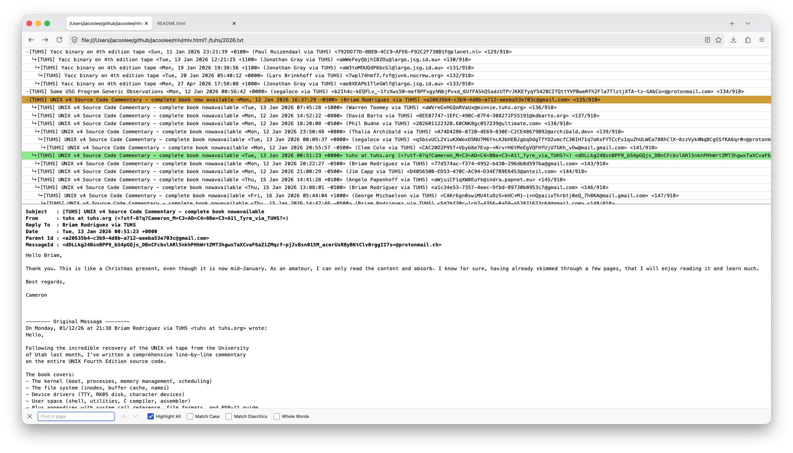

```
NAME
    mlv - maillist viewer

USAGE
    ./mlv.html?{MAIL_LIST_FILE}
    If using with local maillist file, ensure web browser's local file access ability is enabled.

EXAMPLE
    ./mlv.html?./tuhs/2026.txt

HOTKEYS
    j - view next message
    k - view previous message
    p - view parent message
    n - view child message
    0 - view first message
    9 - view last message
    1-8 - view message at 1..8/10 percent of all messages

DIAGNOSE
    Check out ./tuhs/NOTE.txt

SCREENSHOT
```

