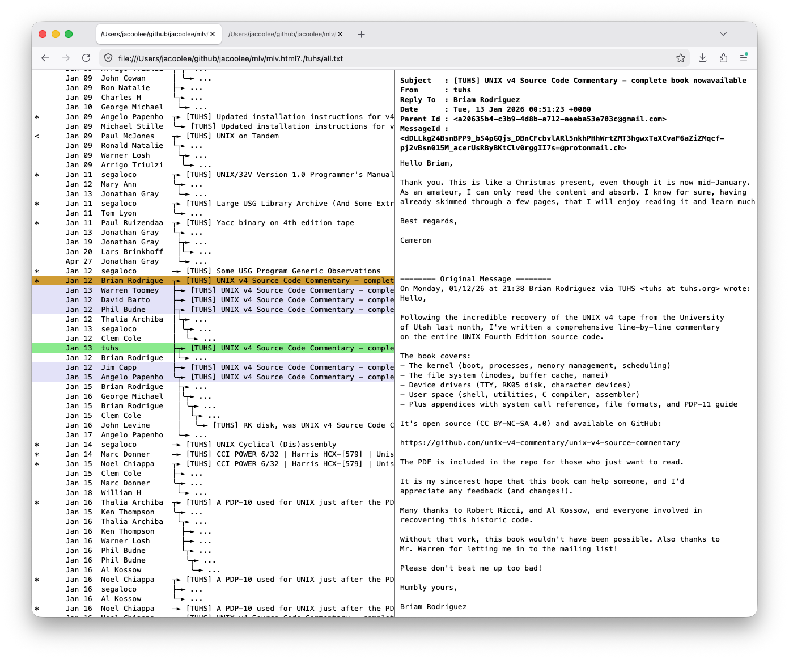
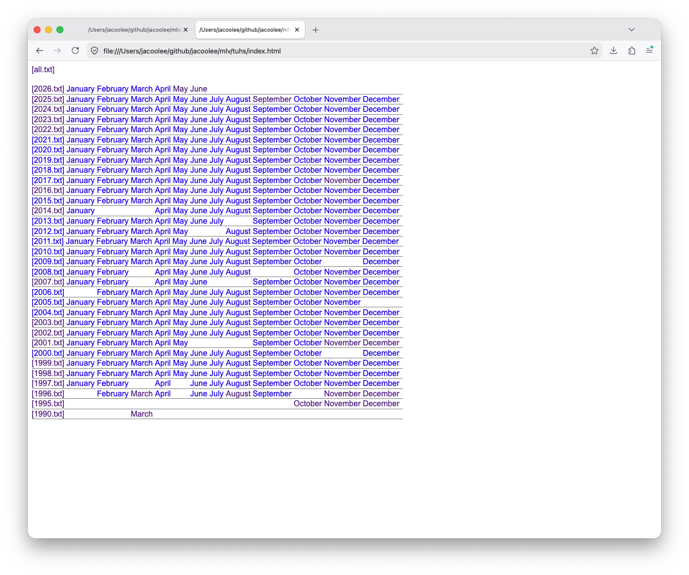

```
NAME
    mlv - maillist viewer

USAGE
    ./mlv.html?{MAIL_LIST_FILE}
    If using with local maillist file, ensure web browser's local file access ability is enabled.

EXAMPLE
    ./mlv.html?./tuhs/2026.txt

HOTKEYS
    j - view next message
    k - view previous message
    h - view next sibling message
    l - view previous sibling message
    p - view parent message
    n - view child message
    0 - view first message
    9 - view last message
    1-8 - view message at 1..8/10 percent of all messages

    b - scroll thread view one page backward
    v - scroll thread view one page forward

    , - center current message in thread view
    . - view message located at top of thread view
    ; - view message located at center of thread view

    SPC - scroll message body view one page forward
    o/u - scroll message body view one page backward

    = - toggle thread view and mailbody view vertical or horizontal
    c - toggle color theme
    i - ./tuhs/index.html
    m - manual

DIAGNOSE
    Check out ./tuhs/NOTE.txt

MARKER
    < - is a reply, but parent message is not in thread
    * - is the root message in thread (star[t])
    $ - (Same) messageId occurs before

SCREENSHOT
```


